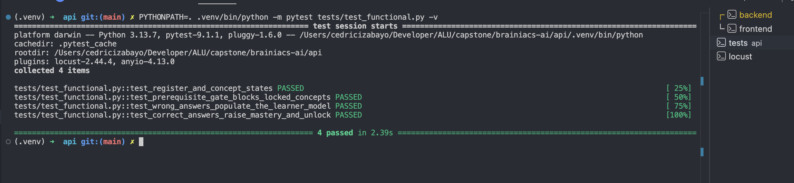
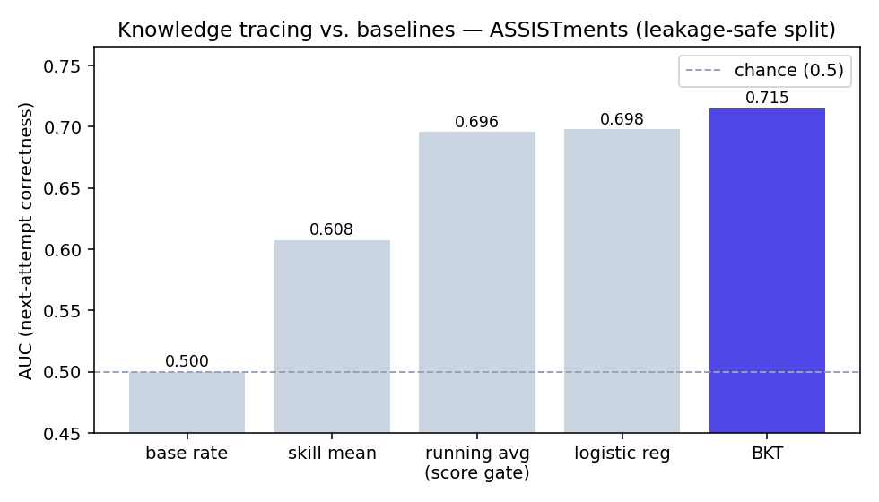
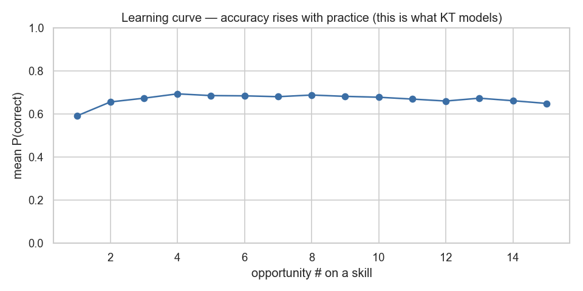

# Brainiacs AI

An adaptive tutor for the **fundamentals of programming**, taught in pseudocode. It
follows a strict prerequisite graph of concepts — a concept stays **locked** until its
prerequisites are mastered — and uses **knowledge tracing** to estimate each learner's
per-concept mastery and decide when to advance them versus give more practice.

Fully **self-hosted**: deterministic grading, no external LLM, no third-party identity
provider — no learner data leaves the system.

- **Live:** https://brainiacs.bwenge.rw
- **Demo video (5 min):** <!-- TODO: paste your unlisted YouTube link here -->

> ML-specialization capstone, African Leadership University.

## Stack

- **api/** — FastAPI + SQLAlchemy + Alembic + PostgreSQL. Email/password JWT auth, the
  seeded exercise bank, deterministic grading, and the BKT mastery gate.
- **web/** — Next.js + Tailwind + NextAuth. Login, dashboard (concept map), lesson, quiz.
- **ml/** — `kt_evaluation.py` (baselines vs BKT + figures), `kt_bkt.py` (NumPy BKT).

## Install & run (step by step)

Prerequisites: Python 3.11+, Node 20+, PostgreSQL 14+. No API keys needed — grading is
deterministic and quizzes come from the seeded bank.

```bash
# 1. Database
psql -d postgres -c "CREATE ROLE brainiacs LOGIN PASSWORD 'brainiacs';"
psql -d postgres -c "CREATE DATABASE brainiacs OWNER brainiacs;"

# 2. Backend  ->  http://localhost:8000  (Swagger UI at /docs)
cp .env.example .env
make api-install && make migrate && make seed && make api

# 3. Frontend ->  http://localhost:3000
make web-install && make web
```

Run the automated tests:

```bash
cd api && PYTHONPATH=. .venv/bin/pip install -r requirements-dev.txt
PYTHONPATH=. .venv/bin/python -m pytest tests/test_functional.py -v
```

## The ML contribution — knowledge tracing

The core machine learning is a **Bayesian Knowledge Tracing** model (a 2-state HMM:
hidden state = mastered / not-mastered; evidence = correct / incorrect; with guess, slip
and learn parameters). It estimates per-concept mastery from a learner's attempt history
and drives the unlock gate.

Evaluated on **ASSISTments 2009** (a public knowledge-tracing benchmark), on a
leakage-safe split (students disjoint between train/test, time-ordered) —
[`ml/kt_evaluation.py`](ml/kt_evaluation.py):

| Method | AUC |
|---|---:|
| base rate | 0.500 |
| per-skill mean | 0.608 |
| running average — the "advance at 80%" score gate | 0.696 |
| logistic regression | 0.698 |
| **BKT** | **0.715** |

**BKT beats the simple score-gate baseline** — the comparison that justifies using the
model. The learning curve ([`ml/figures/kt_learning_curve.png`](ml/figures/kt_learning_curve.png))
shows success rising with practice. ASSISTments is mathematics (out of domain), so it
validates the *method*; the in-domain evidence is the platform's own attempt logs (a
small, growing pilot).

> Future work: a fine-tuned small open-weights model for misconception classification and
> a frontier cost comparison — deferred because no public dataset maps pseudocode answers
> to misconceptions.

## Reproduce the ML evaluation

```bash
cd ml && python3 -m venv .venv && .venv/bin/python -m pip install -r requirements.txt
bash download_data.sh                 # fetch ASSISTments (gitignored, not re-hosted)
.venv/bin/python kt_evaluation.py     # baseline vs BKT table + figures in ml/figures/
```

---

# Testing & Results

Functionality demonstrated under **different testing strategies**, with **different data
values**, and on **different hardware/software specifications**. Screenshots live in
`docs/testing/`.

## 1. Functional testing — automated

Four end-to-end tests cover registration, the prerequisite gate, misconception detection,
and mastery + unlock ([`api/tests/test_functional.py`](api/tests/test_functional.py)).

```bash
cd api && PYTHONPATH=. .venv/bin/python -m pytest tests/test_functional.py -v
```

<!-- SCREENSHOT: docs/testing/functional-tests-pass.png — the 4 green PASSED lines -->
<!--  -->

## 2. Functional testing — core journey (manual)

The full learning loop on the live app:

<!-- SCREENSHOT: docs/testing/func-01-concept-map.png — dashboard, locked vs available concepts -->
<!-- SCREENSHOT: docs/testing/func-02-lesson.png — a lesson open, flowchart renders -->
<!-- SCREENSHOT: docs/testing/func-03-quiz.png — a quiz in progress -->
<!-- SCREENSHOT: docs/testing/func-04-mastery-up.png — mastery % rises after correct answers -->
<!-- SCREENSHOT: docs/testing/func-05-unlock.png — next concept goes locked -> available -->
<!-- SCREENSHOT: docs/testing/func-06-learner-model.png — "Your learner model" panel with a detected misconception -->

## 3. Different data values

Same product, different inputs → correct, contrasting behaviour:

| Input | Expected behaviour | Screenshot |
|---|---|---|
| All-correct answers | mastery passes 85%, concept unlocks | <!-- docs/testing/data-correct.png --> |
| All-wrong answers | mastery stays low, gate holds, misconception flagged | <!-- docs/testing/data-wrong.png --> |
| Brand-new student (cold start) | "Not enough data yet" in the learner panel | <!-- docs/testing/data-coldstart.png --> |
| Empty / nonsense input | handled gracefully, no crash | <!-- docs/testing/data-edge.png --> |

At benchmark scale, the ML evaluation runs across **30 skills / ~49,000 held-out
predictions** ([`ml/kt_results.json`](ml/figures/kt_results.json)).

## 4. Performance / load testing

**Budget:** 95% of API requests under 300 ms at 30 concurrent users; error rate < 1%.

```bash
locust -f api/loadtest/locustfile.py --headless -u 30 -r 5 -t 60s --host http://localhost:8000
```

Measured (read hot path — the concept map and progress endpoints):

| Endpoint | Median | 95%ile | Notes |
|---|---:|---:|---|
| `GET /concepts` | <!-- e.g. 5 ms --> | <!-- e.g. 18 ms --> | the dashboard concept map |
| `GET /progress` | <!-- e.g. 5 ms --> | <!-- e.g. 25 ms --> | the learner model |

<!-- SCREENSHOT: docs/testing/perf-locust.png — Locust Statistics tab -->

> Note: password-based auth (`/auth/register`, `/auth/login`) uses bcrypt hashing, which is
> intentionally CPU-bound. Under an extreme burst of simultaneous *new sign-ups* on a single
> dev worker it becomes the bottleneck; in production the API runs multiple workers and real
> traffic is overwhelmingly reads. (See Future Work.)

Frontend (Lighthouse on the deployed site):

<!-- SCREENSHOT: docs/testing/perf-lighthouse.png — Performance / LCP / TTI scores -->

## 5. Different hardware / software specifications

### Network conditions (Chrome DevTools throttling)

| Network profile | Bandwidth | Page load | Usable? |
|---|---|---:|---|
| No throttling (Wi-Fi) | full | <!-- measure --> | yes |
| Fast 4G | ~4 Mbps | <!-- measure --> | <!-- --> |
| Slow 3G | ~0.4 Mbps | <!-- measure --> | <!-- --> |
| Custom 2 Mbps | 2 Mbps | <!-- measure --> | <!-- --> |

<!-- SCREENSHOT: docs/testing/hw-network-throttle.png — DevTools Network panel under throttling -->

### Browsers, screen sizes, and server footprint

<!-- SCREENSHOT: docs/testing/hw-browsers.png — Chrome / Safari / Firefox render consistently -->
<!-- SCREENSHOT: docs/testing/hw-responsive.png — mobile + desktop layouts -->
<!-- SCREENSHOT: docs/testing/hw-docker-stats.png — `docker stats` on the VM -->

Minimum server spec: <!-- e.g. runs within ~1 GB RAM across db/api/web; a 1 vCPU / 2 GB VM is sufficient -->.

## 6. ML model accuracy




BKT reaches **AUC 0.715**, beating the score-gate baseline (0.696) on a leakage-safe split.
Beyond accuracy, it reports AUC and **recall on the wrong-answer class** (catching
not-yet-mastered learners — the costly error). ASSISTments is out-of-domain math, so this
validates the method; in-domain evidence is the platform's own (small, growing) logs.

---

# Analysis

Results against the objectives in the project proposal:

| Objective | Evidence | Verdict |
|---|---|---|
| Sequence concepts by prerequisite mastery | Locked concepts open only at ≥85% mastery (functional test + screenshot func-05) | **Achieved** |
| Model knowledge with knowledge tracing (not a fixed gate) | BKT AUC 0.715 beats the score-gate baseline 0.696 and logistic regression 0.698 | **Achieved** (modest, real margin) |
| Show learners progress | Learning curve rises ~0.57 → 0.69 with practice | **Achieved** as evidence; a causal claim needs a controlled study (future work) |
| Make the AI visible | "Your learner model" panel surfaces mastery + detected misconceptions | **Achieved** |
| Affordable & data-sovereign | Self-hosted, no external LLM; runs in ~1 GB RAM; usable at ~2 Mbps | **Achieved** |
| Misconception classifier (stretch) | Deferred — no labelled pseudocode→misconception dataset exists | **Missed / future work** |

The 0.715 vs 0.696 margin is small but meaningful: it shows the learner model adds signal
over a fixed threshold, which is what justifies knowledge tracing as the ML contribution
rather than a simple `if score > 80%` rule.

---

# Discussion

- **Why these milestones mattered.** Moving from a score gate to a learner model is the
  difference between "did they pass this quiz" and "does the system believe they understand
  the concept" — the latter is what makes honest sequencing possible.
- **Impact of the results.** A self-hosted tutor that beats its baseline and exposes its own
  reasoning is directly usable in low-budget, low-connectivity settings where frontier-API
  tutors are impractical, and it keeps learner data in-country.
- **What changed along the way.** The design moved to deterministic grading with no external
  LLM once affordability and data sovereignty became the priority — a deliberate trade of
  generative flexibility for cost, privacy, and reproducibility.

---

# Recommendations & Future Work

- **Grow the in-domain pilot** (ethics approval obtained) to produce learning curves on real
  pseudocode-learner data, not only the math benchmark.
- **Add the misconception classifier** once a labelled pseudocode dataset exists (or build one
  from the platform's own graded logs).
- **Deploy DKT** (prototyped, AUC ≈ 0.755) if the dataset grows enough to train it robustly.
- **Multiple API workers + connection pooling** to remove the auth-under-burst bottleneck.
- **Community use:** a school can run the whole stack on one modest VM with no per-student API
  cost — recommended for a pilot at the Rwanda Coding Academy.

---

# Deployment

**Plan (steps, tools, environments).** Docker Compose (`db` + `api` + `web`) behind host
**nginx** on a StrangeCloud Linux VM; TLS via certbot. nginx routes
`brainiacs.bwenge.rw → web` and `api.brainiacs.bwenge.rw → api`. **Push-to-deploy CI/CD**
([`.github/workflows/deploy.yml`](.github/workflows/deploy.yml)): a push to `main` rebuilds
and redeploys. Full step-by-step runbook: **[DEPLOY.md](DEPLOY.md)**.

```
            https://brainiacs.bwenge.rw  (TLS, certbot)
                          |
                   [ host nginx ]  reverse proxy
                    /            \
         web (3000)               api (8000)
        [ Next.js ] ----------> [ FastAPI: BKT, KT ] ----> [ PostgreSQL ]

  push to main -> GitHub Actions -> SSH -> docker compose up -d --build
```

**Verification in the target environment** (not just locally — run the journey on the live URL):

<!-- SCREENSHOT: docs/testing/deploy-live.png — the live site with the URL bar visible -->
<!-- SCREENSHOT: docs/testing/deploy-verify.png — a quiz -> mastery update on https://brainiacs.bwenge.rw -->
<!-- SCREENSHOT: docs/testing/deploy-cicd.png — a green GitHub Actions deploy run -->
